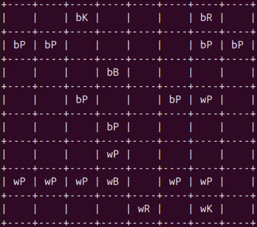

# A Console-Only Shell of a Chess Engine

This? &nbsp;&nbsp; *slaps the roof of the console* &nbsp;&nbsp; This is Jurard.

This gorgeous mess drove me insane over the course of 8 weeks, and now you can see it in action for yourself!

### With wonderful features like...

- giving up a Rook Queen fork!

- alpha beta pruning!

- undoing moves!

- not knowing how to make a checkmate!

  
Give it up for Jurard, everyone! He really is trying his best with what I've given him.

[A poor man's documentation](https://eucarious.github.io/worlds-worst-chessbot/html/)

----

A 8-week chess engine made from the ground up for my Data Structures and Algorithms course.
